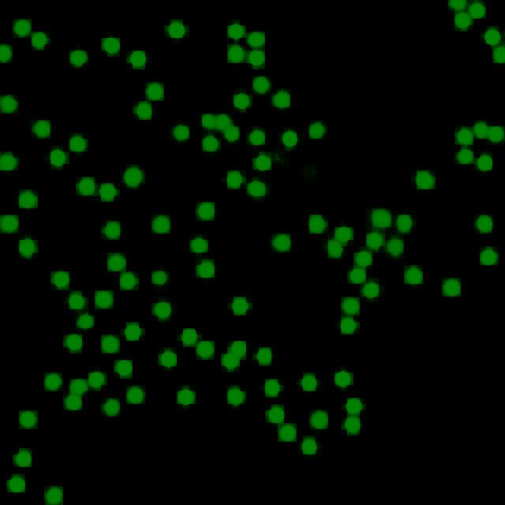

<h2>Tensorflow-Image-Segmentation-Modified-Bone-Marrow-Cell (2024/09/19)</h2>

This is the first experiment of Image Segmentation for Modified-Bone-Marrow (MBM) Cell based on
the <a href="https://github.com/sarah-antillia/Tensorflow-Image-Segmentation-API">Tensorflow-Image-Segmentation-API</a>, and
Pre-Augmented 640x640 pixels
<a href="https://drive.google.com/file/d/1xsEr_evZ_9sLr-TGyAnkEkPt-lLBLMLa/view?usp=sharing">
MBM-ImageMask-Dataset.zip</a>, which was derived by us from 
<a href="https://github.com/ieee8023/countception/blob/master/MBM_data.zip">
MBM_data.zip</a> for counting objects.
 
 
<!--
Please see also 
<a href="https://github.com/sarah-antillia/ImageMask-Dataset-Modified-Bone-Marrow">
ImageMask-Dataset-Modified-Bone-Marrow</a> 
-->

<b>Actual Image Segmentation for Images of 640x640 pixels</b> 
As shown below, the inferred masks look similar to the ground truth masks.  

<table>
<tr>
<th>Input: image</th>
<th>Mask (ground_truth)</th>
<th>Prediction: inferred_mask</th>
</tr>
<tr>
<td></td>
<td></td>
<td></td>
</tr>

<tr>
<td></td>
<td></td>
<td></td>
</tr>

<tr>
<td></td>
<td></td>
<td></td>
</tr>

</table>

 
In this experiment, we used the simple UNet Model 
<a href="./src/TensorflowUNet.py">TensorflowSlightlyFlexibleUNet</a> for this MBM Segmentation Model. 
As shown in <a href="https://github.com/sarah-antillia/Tensorflow-Image-Segmentation-API">Tensorflow-Image-Segmentation-API</a>.
you may try other Tensorflow UNet Models: 

<li><a href="./src/TensorflowSwinUNet.py">TensorflowSwinUNet.py</a></li>
<li><a href="./src/TensorflowMultiResUNet.py">TensorflowMultiResUNet.py</a></li>
<li><a href="./src/TensorflowAttentionUNet.py">TensorflowAttentionUNet.py</a></li>
<li><a href="./src/TensorflowEfficientUNet.py">TensorflowEfficientUNet.py</a></li>
<li><a href="./src/TensorflowUNet3Plus.py">TensorflowUNet3Plus.py</a></li>
<li><a href="./src/TensorflowDeepLabV3Plus.py">TensorflowDeepLabV3Plus.py</a></li>

 

<h3>1 Dataset Citation</h3>
We used <a href="./generator/ImageMaskDatasetGenerator.py">ImageMaskDatasetGenerator.py</a>
to create the Pre-Augmented segmentation dataset from a point-wise dataset for objects-counting
<a href="https://github.com/ieee8023/countception/blob/master/MBM_data.zip">
MBM_data.zip</a> 
 in <a href="https://github.com/ieee8023/countception">https://github.com/ieee8023/countception
</a>.  

<b>Citation request:</b> 
Count-ception: Counting by Fully Convolutional Redundant Counting 
JP Cohen, G Boucher, CA Glastonbury, HZ Lo, Y Bengio 
International Conference on Computer Vision (ICCV) Workshop on Bioimage Computing 

@inproceedings{Cohen2017, 
title = {Count-ception: Counting by Fully Convolutional Redundant Counting}, 
author = {Cohen, Joseph Paul and Boucher, Genevieve and Glastonbury, Craig A. and Lo, Henry Z. and Bengio, Yoshua}, 
booktitle = {International Conference on Computer Vision Workshop on BioImage Computing},
url = {http://arxiv.org/abs/1703.08710}, 
year = {2017} 
} 
 
<h3>2 MBM ImageMask Dataset
</h3>
 If you would like to train this MBM Segmentation model by yourself,
 please download the dataset from the google drive 
<a href="https://drive.google.com/file/d/1xsEr_evZ_9sLr-TGyAnkEkPt-lLBLMLa/view?usp=sharing">
MBM-ImageMask-Dataset.zip</a>
, expand the downloaded ImageMaskDataset and put it under <b>./dataset</b> folder to be
<pre>
./dataset
└─MBM
    ├─test
    │   ├─images
    │   └─masks
    ├─train
    │   ├─images
    │   └─masks
    └─valid
        ├─images
        └─masks
</pre>

<b>MBM Dataset Statistics</b> 
 
 
As shown above, the number of images of train and valid datasets is not enough large to use for a training set for our segmentation model.
  

 
<b>Train_images_sample</b> 

 
<b>Train_masks_sample</b> 

 

<h3>3 Train TensorflowUNet Model</h3>
 We have trained MBMTensorflowUNet Model by using the following
<a href="./projects/TensorflowSlightlyFlexibleUNet/MBM/train_eval_infer.config"> <b>train_eval_infer.config</b></a> file.  
Please move to ./projects/TensorflowSlightlyFlexibleUNet/MBM and run the following bat file. 
<pre>
>1.train.bat
</pre>
, which simply runs the following command. 
<pre>
>python ../../../src/TensorflowUNetTrainer.py ./train_eval_infer.config
</pre>

<b>Model parameters</b> 
Defined a small <b>base_filters</b> and large <b>base_kernels</b> for the first Conv Layer of Encoder Block of 
<a href="./src/TensorflowUNet.py">TensorflowUNet.py</a> 
and a large num_layers (including a bridge between Encoder and Decoder Blocks).
<pre>
[model]
model          = "TensorflowUNet"
image_width    = 640
image_height   = 640
image_channels = 3
num_classes    = 1
base_filters   = 16
base_kernels   = (11,11)
num_layers     = 7
</pre>

<b>Learning rate</b> 
Defined a small learning rate.  
<pre>
[model]
learning_rate  = 0.00008
</pre>

<b>Online augmentation</b> 
Disabled our online augmentation.  
<pre>
[model]
generator     = False
</pre>

<b>Loss and metrics functions</b> 
Specified "bce_dice_loss" and "dice_coef". 
<pre>
[model]
loss           = "bce_dice_loss"
metrics        = ["dice_coef"]
</pre>
<b>Learning rate reducer callback</b> 
Enabled learing_rate_reducer callback, and a small reducer_patience.
<pre> 
[train]
learning_rate_reducer = True
reducer_factor     = 0.4
reducer_patience   = 4
</pre>

<b>Early stopping callback</b> 
Enabled early stopping callback with patience parameter.
<pre>
[train]
patience      = 10
</pre>

<b>Epoch change inference callbacks</b> 
Enabled epoch_change_infer callback. 
<pre>
[train]
epoch_change_infer       = True
epoch_change_infer_dir   =  "./epoch_change_infer"
epoch_changeinfer        = False
epoch_changeinfer_dir    = "./epoch_changeinfer"
num_infer_images         = 1
</pre>

By using this callback, on every epoch_change, the inference procedure can be called
 for an image in <b>mini_test</b> folder. This will help you confirm how the predicted mask changes 
 at each epoch during your training process.    

<b>Epoch_change_inference output</b> 
 
 
 

In this experiment, the training process was stopped at epoch 99 by EarlyStopping Callback.  
 
 

 
<a href="./projects/TensorflowSlightlyFlexibleUNet/MBM/eval/train_metrics.csv">train_metrics.csv</a> 
 

 
<a href="./projects/TensorflowSlightlyFlexibleUNet/MBM/eval/train_losses.csv">train_losses.csv</a> 
 

 

<h3>
4 Evaluation
</h3>
Please move to a <b>./projects/TensorflowSlightlyFlexibleUNet/MBM</b> folder, 
and run the following bat file to evaluate TensorflowUNet model for MBM. 
<pre>
./2.evaluate.bat
</pre>
This bat file simply runs the following command.
<pre>
python ../../../src/TensorflowUNetEvaluator.py ./train_eval_infer_aug.config
</pre>

Evaluation console output: 

  

<a href="./projects/TensorflowSlightlyFlexibleUNet/MBM/evaluation.csv">evaluation.csv</a> 

The loss (bce_dice_loss) to this MBM/test was not so low, and dice_coef not so high as shown below.
 
<pre>
loss,0.2146
dice_coef,0.7351
</pre>

<h3>
5 Inference
</h3>
Please move to a <b>./projects/TensorflowSlightlyFlexibleUNet/MBM</b> folder 
,and run the following bat file to infer segmentation regions for images by the Trained-TensorflowUNet model for MBM. 
<pre>
./3.infer.bat
</pre>
This simply runs the following command.
<pre>
python ../../../src/TensorflowUNetInferencer.py ./train_eval_infer_aug.config
</pre>

<b>mini_test_images</b> 
 
<b>mini_test_mask(ground_truth)</b> 
 

<b>Inferred test masks</b> 
 
 

<b>Enlarged images and masks </b> 

<table>
<tr>
<th>Image</th>
<th>Mask (ground_truth)</th>
<th>Inferred-mask</th>
</tr>

<tr>
<td></td>
<td></td>
<td></td>
</tr>

<tr>
<td></td>
<td></td>
<td></td>
</tr>

<tr>
<td></td>
<td></td>
<td></td>
</tr>
<tr>
<td></td>
<td></td>
<td></td>
</tr>
<tr>
<td></td>
<td></td>
<td></td>
</tr>

</table>

 
<h3>
References
</h3>
<b>1. Count-Ception: Counting by Fully Convolutional Redundant Counting (arXiv)</b> 
Joseph Paul Cohen, Genevieve Boucher, Craig A. Glastonbury, Henry Z. Lo, Yoshua Bengio 
<a href="https://arxiv.org/pdf/1703.08710">https://arxiv.org/pdf/1703.08710</a>
 
 
<b>2. SAU-Net: A Universal Deep Network for Cell Counting</b> 
Yue Guo, Guorong Wu, Jason Stein, and Ashok Krishnamurthy 
ACM BCB. 2019 Sep; 2019: 299–306. 
doi: 10.1145/3307339.3342153 
<a href="https://www.ncbi.nlm.nih.gov/pmc/articles/PMC8153189/">https://www.ncbi.nlm.nih.gov/pmc/articles/PMC8153189/</a>
  
<b>3. Machine-Based Detection and Classification for Bone Marrow Aspirate Differential Counts:  
Initial Development Focusing on Non-Neoplastic Cells
</b> 
 doi: 10.1038/s41374-019-0325-7 
<a href="https://www.ncbi.nlm.nih.gov/pmc/articles/PMC6920560/">https://www.ncbi.nlm.nih.gov/pmc/articles/PMC6920560/</a>

 
 
<b>4. MSCA-UNet: Multi-Scale Convolutional Attention UNet for Automatic Cell Counting Using Density Regression</b> 
L. Qian, W. Qian, D. Tian, Y. Zhu, H. Zhao and Y. Yao,   
doi: 10.1109/ACCESS.2023.3304993. 
<a href="https://ieeexplore.ieee.org/document/10216972">https://ieeexplore.ieee.org/document/10216972</a>
 
 

